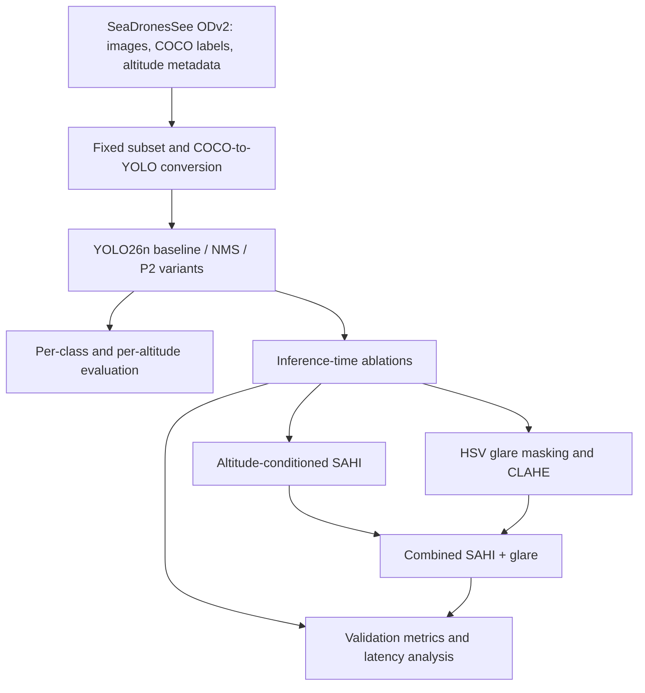

# ALT YOLO: Altitude-Aware Maritime UAV Object Detection for Search and Rescue

**Experimental computer vision research | SeaDronesSee ODv2 | YOLO26 | Tiny-object detection | Altitude-conditioned SAHI**

> **Project status:** Completed experimental course research report (COE 595). The results below are **reported validation-set findings from this study**, not official SeaDronesSee test-server scores or claims of a peer-reviewed publication. [Read the full report](paper/ALT_YOLO_Research_Report.pdf).

## Research problem

Detecting swimmers and other rescue-relevant objects from UAV imagery is difficult because targets may occupy only a few pixels. Camera altitude changes apparent object scale, while waves, reflections, glare, and background clutter complicate detection. Improvements that recover more candidate objects may also increase false positives or inference latency.

**Research question:** How do detection-head configuration, altitude-aware image slicing, and glare preprocessing affect accuracy, recall, and computational cost for maritime UAV object detection?

## What I did

This project goes beyond a literature survey: I prepared a subset of **SeaDronesSee Object Detection v2**, trained and evaluated multiple YOLO26 configurations, and conducted inference-time ablations.

1. **Prepared the data:** Selected a fixed, seeded subset of 4,268 images; converted COCO bounding boxes to normalized YOLO labels; excluded the dataset's `ignored` category from the five scored classes; and used available altitude metadata to stratify evaluation.
2. **Compared detector configurations:** Fine-tuned a YOLO26n baseline (**M1**), evaluated a non-end-to-end/NMS variant (**M2**), and trained the official YOLO26-P2 configuration with default (**M3a**) and adjusted bounding-box loss weights (**M3b**).
3. **Evaluated by altitude and class:** Compared mAP@50 and recall across low, medium, high, and unknown-altitude bins, as well as per-class AP.
4. **Implemented altitude-conditioned SAHI inference:** Used smaller slices at higher altitude and larger slices at lower altitude, then merged tile predictions. Compared it with fixed-size slicing and performed a validation-set evaluation using a manual AP calculation.
5. **Tested glare-aware preprocessing:** Used an HSV-based bright/low-saturation mask, selective intensity suppression, and CLAHE contrast enhancement. Evaluated glare preprocessing alone and together with SAHI.

These activities and results are documented in the [report](paper/ALT_YOLO_Research_Report.pdf), especially Sections 4–6.

## Experimental design



| Setting | Reported configuration |
| --- | --- |
| Dataset | SeaDronesSee Object Detection v2 |
| Full benchmark | 14,227 images (8,930 train / 1,547 validation / 3,750 test) |
| Study subset | **4,268 images** (2,679 train / 464 validation / 1,125 test) |
| Scored categories | Swimmer, boat, jetski, life-saving appliance, buoy |
| Input resolution | 1280 × 1280 |
| Training | 50 epochs, batch size 8, seed 42 |
| Training hardware | NVIDIA Quadro P6000 (24 GB), Paperspace Gradient |
| Inference/ablation hardware | NVIDIA Quadro RTX 4000 (8 GB), as reported |
| Quantitative evaluation | **464-image validation split**; official test labels not available |

The study used a subset due to computational constraints. The 1,125-image test subset was used for descriptive glare statistics, **not labeled test-set accuracy evaluation**.

## Experimental results

### 1. Detector comparison

Reported on the **464-image validation split** (report, Table 4, p. 10):

| Model | mAP@50 | mAP@50–95 | Precision | Recall |
| --- | ---: | ---: | ---: | ---: |
| M1 — YOLO26n baseline | **0.8150** | **0.4758** | **0.8610** | **0.7854** |
| M2 — YOLO26n, NMS variant | **0.8150** | **0.4758** | **0.8610** | **0.7854** |
| M3a — YOLO26-P2, box loss 7.5 | 0.7653 | 0.4282 | 0.7863 | 0.7287 |
| M3b — YOLO26-P2, box loss 9.0 | 0.7524 | 0.4256 | 0.7609 | 0.7410 |

**Interpretation:** The P2 variants did **not** outperform the baseline under the reported 50-epoch training budget. Raising the P2 box-loss weight improved recall relative to M3a (0.7410 vs. 0.7287), but lowered mAP@50 and mAP@50–95. M1 and M2 produced identical aggregate scores in this experiment.

### 2. Altitude is an important failure condition

For the baseline M1 (report, Table 10, p. 11):

| Altitude bin | mAP@50 |
| --- | ---: |
| High (≥ 40 m) | **0.6130** |
| Medium (15–40 m) | **0.8483** |
| Low (< 15 m) | 0.6673 |
| Unknown | 0.7032 |

The **23.53-percentage-point gap** between medium- and high-altitude mAP@50 motivates condition-aware evaluation. These results show an association between capture altitude and detection difficulty; they do not by themselves establish altitude as the only causal factor.

Per-class evaluation also identified **life-saving appliances** as the most difficult scored category for M1 (AP@50 = **0.5497**), compared with **0.9583** for boats (report, Table 5, p. 10).

### 3. SAHI and glare ablation

Reported validation-set measurements (report, Table 8, p. 10):

| Inference condition | mAP@50 | Recall | Average detections/image |
| --- | ---: | ---: | ---: |
| A — Standard baseline | **0.8150** | 0.7854 | Not reported |
| B — Glare preprocessing only | 0.7232 | 0.6890 | Not reported |
| C — Altitude-conditioned SAHI only | 0.7319 | **0.8557** | 6.60 |
| D — SAHI + glare preprocessing | 0.6239 | 0.7862 | 10.54 |

**Interpretation:** SAHI-only inference increased reported recall by **7.03 percentage points** relative to the baseline, but its reported mAP@50 was lower. Glare preprocessing reduced mAP@50, both alone and in the combined pipeline. More detections **do not necessarily mean more correct detections**.

**Important evaluation qualification:** The report describes a *manual precision–recall/AP computation* for SAHI conditions C and D. These values should be treated as **study-level validation estimates**, not official challenge-server scores or fully protocol-matched comparisons with the standard model evaluator.

### 4. Adaptive slicing versus fixed slicing

The fixed-versus-adaptive **detection-count** comparison (20 images per altitude bin; report, Table 7, p. 10) did **not** show an increase in average detections from adaptive slicing:

| Altitude bin | Fixed 320×320 | Altitude-conditioned |
| --- | ---: | ---: |
| High | 8.30 | 8.20 |
| Medium | 6.65 | 6.65 |
| Low | 2.05 | 1.95 |
| Unknown | 6.90 | 6.90 |

This comparison is separate from the **59.7% increase in average detection count** reported when *glare preprocessing was added to SAHI* (6.60 to 10.54 detections/image, Table 8). Neither count change should be presented as an accuracy improvement without ground-truth matching.

### 5. Inference cost

Standard M1 inference was reported at **12.7 ms/image** (preprocessing + inference + postprocessing; report, Table 6). The SAHI-only run took approximately **2,447 seconds for 464 validation images**, or **5.3 seconds/image** (report, Section 6.4). This makes the tested SAHI configuration unsuitable for real-time onboard use without substantial optimization. The study did **not** benchmark on an onboard UAV computer.

## Key lessons

- **Condition-stratified evaluation matters:** aggregate AP obscures substantial differences between altitude bins.
- **More model complexity did not guarantee better accuracy:** the P2 branch underperformed the baseline within this study's training budget.
- **Recall and precision-oriented metrics can diverge:** SAHI increased recall but decreased reported mAP@50.
- **Image enhancement needs careful targeting:** glare preprocessing hurt aggregate accuracy on this validation subset.
- **Deployment claims require latency measurements:** full-image inference and tiled inference had very different costs.

## Scope and limitations

- All reported detection metrics come from a **fixed 30% subset** and **validation images**, not an official SeaDronesSee test submission.
- SAHI AP was manually calculated; the report does not establish strict equivalence with the official evaluation server.
- Fixed-versus-adaptive SAHI detection counts did not show an improvement on the reported small sample.
- The P2 experiments used a 50-epoch training budget; conclusions about longer training remain hypotheses.
- The repository currently includes the **research report and transcribed result summaries**, not training scripts, model weights, raw prediction files, or execution logs. These would be needed for independent reproduction.
- The original SeaDronesSee images and annotations are **not redistributed** here.

## Repository contents

```text
.
├── README.md
├── paper/
│   └── ALT_YOLO_Research_Report.pdf  # Author-provided research report
├── results/
│   ├── model_comparison.csv           # Report Table 4
│   ├── per_altitude_map50.csv         # Report Table 10
│   ├── inference_ablations.csv        # Report Table 8
│   └── sahi_slice_comparison.csv      # Report Table 7
├── docs/
│   └── experimental_protocol.md      # Settings, provenance, limitations
└── .gitignore
```

The CSVs are **transcriptions of tables in the report**, not newly executed experiments or raw model output.

## Future work

Potential next steps identified from the experiments include longer P2 training on the full training set, better controlled AP evaluation of slicing strategies, selective rather than broad glare enhancement, camera-angle stratification, and deployment profiling on actual edge hardware. **These are proposals, not completed results.**

## References and data attribution

- [Research report (PDF)](paper/ALT_YOLO_Research_Report.pdf) — *ALT YOLO: Altitude Aware YOLO Maritime UAV Vision for Search and Rescue* (COE 595 research report).
- Varga et al., *SeaDronesSee: A Maritime Benchmark for Detecting Humans in Open Water*, WACV 2022. [Paper](https://openaccess.thecvf.com/content/WACV2022/html/Varga_SeaDronesSee_A_Maritime_Benchmark_for_Detecting_Humans_in_Open_Water_WACV_2022_paper.html).
- [SeaDronesSee official repository](https://github.com/Ben93kie/SeaDronesSee).
- [Ultralytics repository](https://github.com/ultralytics/ultralytics).

**Research integrity note:** This repository describes experiments reported in the linked manuscript. It does not claim a new state-of-the-art detector, independent replication, an official benchmark submission, or a peer-reviewed publication.
